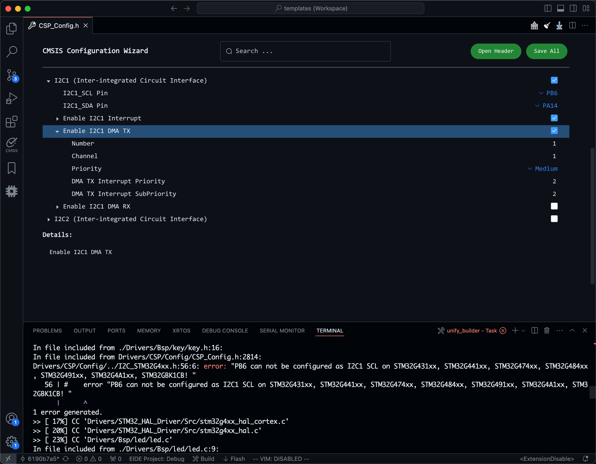
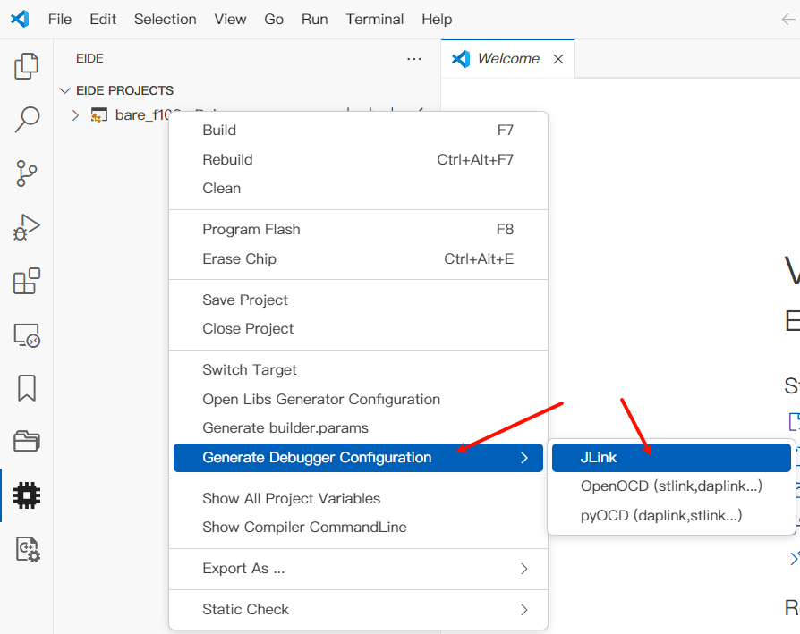
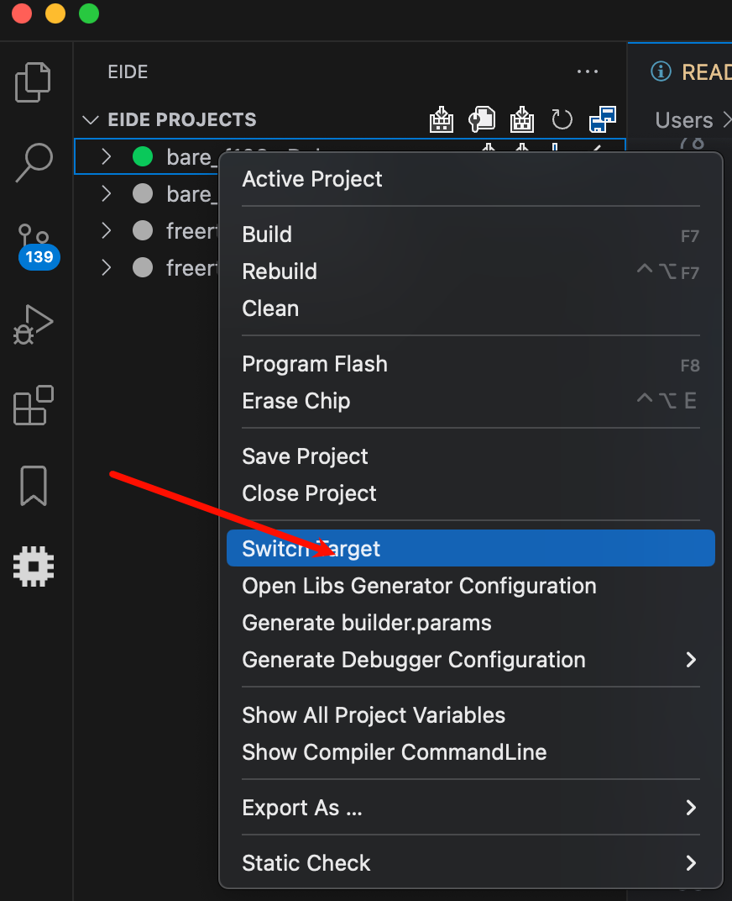

# STM32 新建工程模板文件

F1 基于正点原子 MiniSTM32 (STM32F103RCT6) 制作，外部晶振 8 MHz，工作频率 72 MHz。

F4 基于正点原子阿波罗 (STM32F429IGT6) 制作，外部晶振 25 MHz，工作频率 180 MHz。

G4 基于 STM32G474VET6 制作，外部晶振 25 MHz，工作频率 170 MHz。

STM32G474 的开发板是自己制作的兼容正点原子阿波罗底板的核心板，您可以从 Release 中下载该 PCB。

程序下载后可以看到跑马灯，串口 1 每隔 1 秒发送`xxx Template, Runnting Time: xxx ms. `按下按键在串口 1 发送`xxx Pressed`.

感谢@[shanlingjiangjie](https://github.com/shanlingjiangjie) @[PickingChip](https://github.com/PickingChip) @[meiwenhuaqingnian](https://github.com/meiwenhuaqingnian) 的测试。

感谢@[LuLongXiang](https://github.com/LuLongXiang)绘制的 G474 核心板。

## [更新日志](./CHANGELOG.md)

# 预设文件

Bsp 层添加了按键，LED, 串口和 C 库系统 IO 重定义。默认只启用了串口 1, 没有使用 DMA.

按键，LED 按照正点原子开发板编写，如需更改，自行到`Drivers/Bsp/led/led.h`和`Drivers/Bsp/key/key.h`中更改相应的 IO.

在`User/Application/Inc/version.h`中定义了模板版本号，可以通过其中预定义的一些函数来获取。

CSP 层配置`/Drivers/CSP/CSP_Config.h`, FreeRTOS 配置`/User/Application/Inc/FreeRTOSConfig.h`支持 CMSIS Configuration Wizard, 可以使用图形化界面来配置，参照：[CMSIS 头文件配置向导](https://em-ide.com/zh-cn/docs/advance/cmsis_cfg_wizard) [CMSIS 配置向导标记 | Deadline039](https://deadline039.github.io/Embedded/cmsis_config_wizard).


默认堆栈大小均为 0x1000。

## 芯片支持包（Chip Support Package）

为简化芯片外设的初始化与使用，CSP 层配置文件（位于 Drivers/）可以用图形化界面选择开启或者关闭某个外设，并且可以很方便地查看与修改引脚与 DMA 通道，而且可以检测引脚是否在当前芯片可用，大大简化了外设的初始化与配置流程：



# 使用方法

1. 到 Releases 下载 ept 文件。
   
   
   
   

2. 打开 vsocde, 点击左边的 EIDE 图标，选择新建工程。
   
   

3. 在上方正中间弹出的列表选择本地模板。
   
   

4. 选择模板文件，然后输入工程名称。
   
   
   
   

5. 选择工程存放的位置，然后在 vscode 窗口右下角弹出的窗口选择 Yes.
   
   
   
   

这样，一个工程就创建完毕了。编译下载后即可看到跑马灯。

# 更换同一家族芯片型号

F1xx 模板基于 STM32F103RCT6; F4xx 模板基于 STM32F429IGT6; G4xx 模板基于 STM32G474VET6. 模板并不是只适用于这两个型号，而是适用于同一家族的所有型号，可以用以下步骤来更换芯片（以 STM32F429IG 换 STM32F407ZE 为例）:

1. 在 EIDE 中修改芯片型号。
   
   

2. 修改启动文件，在工程分组`Drivers/CMSIS/Startup/startup_xxx.s`中选择更改路径，具体的文件名可以根据芯片的宏定义名来编写。
   
   

3. 修改`bsp_core.c`中的时钟配置（可以用 CubeMX 生成的代码）, 修改不兼容的外设代码，例如不存在的外设。

# 调试配置

首先请确保配置好了 GDB, OpenOCD 或者 pyOCD, JLink GDB Server.

- 右键项目，在弹出的菜单选择相应的调试器：
  
  
  
  - 如果使用 JLink, 选择 JLink, 并填写配置名称 Name, 接口 Interface（建议选 SWD), 芯片名称 Device Name 等。完成后点右上角 Create 完成配置。
    
    
  
  - 如果使用 ST-Link 或者 DAP-Link, 选择 OpenOCD 或 pyOCD, 并填写配置名称 Name, 接口 Interface（是什么调试器就选什么）, 芯片 Target 等。完成后点右上角 Create 完成配置。
    
    
  
  - 注意如果有重名的配置，右下角会弹出警告，自行选择是否覆盖。

- 完成后在左边点击调试和运行 Run and Debug, 选择刚才填写的配置名称，按下 F5 或者点击三角形开始调试。
  
  

# 导出模板

修改完后使用如下方式导出 ept 文件，生成的文件默认在根目录：


# 默认构建参数

## 构建目标 Target

默认的 Target, 即 Debug 会定义`DEBUG`宏，建议在编码调试时开启`DEBUG`宏检查，正式使用版本定义`Release` Target, 删除此宏定义。

使用软件断点时建议用下面的形式，即在软件断点的位置使用`DEBUG`条件编译：
```
#ifdef DEBUG
    __asm("BKPT 0");
#endif /* DEBUG */
```

如果要新建 Target, 右键项目选择 Switch Target, 然后在上方弹出的列表输入新的 Target 名称。




## 编译的文件

为了加快构建速度，默认在工程中只编译下面的 HAL 库驱动：
```
DMA, GPIO, PWR, RCC, UART
```

如果使用其他外设，自行添加即可。

## 编译参数

编译器使用 ARM Compiler 6.22, LTO, C11/C++11 标准，O0 优化。Clang 的语法检查非常严格，因此关闭下面的警告：
|                参数                |                                                                 说明                                                                  |
| :--------------------------------: | :-----------------------------------------------------------------------------------------------------------------------------------: |
|            -Wno-padded             |                                                           结构体/类内存对齐                                                           |
|      -Wno-unsafe-buffer-usage      |                                                          不安全的缓冲区使用                                                           |
|      -Wno-reserved-identifier      |                                                    保留标志位（一般为下划线开头）                                                     |
|       -Wno-missing-noreturn        |                                        死循环函数缺少`__attribute__((__noreturn__))`属性修饰符                                        |
|    -Wno-covered-switch-default     |                                         `default`包含了所有的情况（一般是没有`break`导致的）                                          |
|          -Wno-switch-enum          |                                               `switch`中`case`缺失了一部分枚举值的情况                                                |
|      -Wno-missing-prototypes       |                                                             函数缺少声明                                                              |
|          -Wno-newline-eof          |                                                         文件最后一行不是空行                                                          |
|       -Wno-gnu-pointer-arith       | GNU 的指针用法，参照 [Pointer Arith (Using the GNU Compiler Collection (GCC))](https://gcc.gnu.org/onlinedocs/gcc/Pointer-Arith.html) |
|        -Wno-sign-conversion        |                                                        有符号到无符号类型转换                                                         |
|    -Wno-implicit-int-conversion    |                                         隐式整数转换（大范围到小范围，如`int32_t -> int16_t`)                                         |
|       -Wno-double-promotion        |                                             隐式浮点转换（提高精度，如`float -> double`)                                              |
|  -Wno-missing-field-initializers   |                                                            未初始化的变量                                                             |
|             -Wno-undef             |                                                           未定义就使用的宏                                                            |
|          -Wno-self-assign          |                                                            为自己分配字段                                                             |
|        -Wno-extra-semi-stmt        |                                                          空语句有多余的分号                                                           |
| -Wno-missing-variable-declarations |                                           全局变量没有外部声明（在该源文件包含的头文件中）                                            |
|          -Wno-cast-align           |                                                           强制转换对齐要求                                                            |
|   -Wno-implicit-float-conversion   |                                             隐式浮点转换（降低精度，如`double -> float`)                                              |
|        -Wno-missing-braces         |                                        缺失括号（一般是`if (x) xxx();`这种单行不加括号的情况）                                        |
|           -Wno-cast-qual           |                                                 强制类型转换中保证所有指针都是安全的                                                  |
|       -Wno-format-nonliteral       |                                               格式字符串中的格式控制符没有一一对应变量                                                |
|      -Wno-gnu-binary-literal       |                                             GNU 二进制字面量 (`0b0001`表示二进制数 0001)                                              |

具体参照：https://clang.llvm.org/docs/DiagnosticsReference.html

# 工程结构目录

目录结构如下：
```
├─.eide                        EIDE 工程配置
├─.pack                        EIDE pack 依赖
├─.vscode                      vscode 配置
├─build                        编译生成目录
├─Drivers                      底层驱动
│  ├─CMSIS                     CMSIS 驱动，包括 Startup 和外设定义
│  ├─STM32_HAL_Driver          HAL 库
│  ├─Bsp                      板层驱动文件
│  └─CSP                       芯片驱动支持包
├─Middlewares                  中间件，存放如 FreeRTOS, LVGL 等组件的文件
└─User                         用户提供的源文件
    ├─Application              Application 层文件
    └─Utils                    常用工具，例如队列，缓冲区填充等。独立于芯片
```

CSP 是指的 Chip Support package, 存放一些常用外设的初始化与使用的代码，简化外设的初始化流程，并提供一些外设的操作函数。

为了方便工程文件管理和全局查找，工程文件 (.code-workspace) 在工程根目录下。

HAL 库和 FreeRTOS 的配置头文件在`User/Application/Inc`下。

工程结构如图：


# 问题反馈

直接提 Issue 或者给我发邮件：deadline039#outlook.com, 1315374252#qq.com(#换成@, 这样做是为了防止垃圾邮件）
