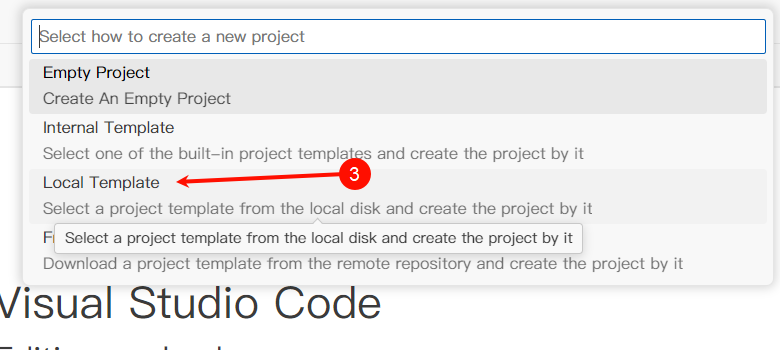

# STM32新建工程模板文件

F103基于正点原子MiniSTM32制作。F429基于正点原子阿波罗板制作。

程序下载后可以看到跑马灯，串口1每隔1秒发送`xxx Template, Runnting Time: xxx ms. `按下按键在串口1发送`xxx Pressed`.

感谢@[shanlingjiangjie](https://github.com/shanlingjiangjie) @[PickingChip](https://github.com/PickingChip) @[meiwenhuaqingnian](https://github.com/meiwenhuaqingnian) 的测试。

## [更新日志](./CHANGELOG.md)

# 预设文件

Bsp层添加了按键、LED、串口（包括DMA）和C库底层IO重定义。默认只启用了串口1，没有使用DMA，可以在`User/Bsp/Inc/uart.h`中选择串口配置。

按键、LED按照正点原子开发板编写，如需更改，自行到`User/Bsp/Inc/led.h`和`User/Bsp/Inc/key.h`中更改相应的GPIO。

串口配置`/User/Bsp/Inc/uart.h`，FreeRTOS配置`/User/Application/Inc/FreeRTOSConfig.h`支持CMSIS Configuration Wizard，可以使用图形化界面来配置，参照：[CMSIS 头文件配置向导](https://em-ide.com/zh-cn/docs/advance/cmsis_cfg_wizard)。


**UART默认使用函数指针回调**。如果用弱函数重定义方式回调的话，在`User/Application/Inc/stm32fxxx_hal_conf.h`中更改。

# 使用方法

1. 到Releases下载ept文件。
   
   
   
   

2. 打开vsocde，点击左边的EIDE图标，选择新建工程。
   
   

3. 在上方正中间弹出的列表选择本地模板。
   
   

4. 选择模板文件，然后输入工程名称。
   
   
   
   

5. 选择工程存放的位置，然后在vscode窗口右下角弹出的窗口选择Yes。
   
   
   
   

这样，一个工程就创建完毕了。编译下载后即可看到跑马灯。

# 调试配置

首先请确保配置好了GDB、OpenOCD或者pyOCD、JLink GDB Server。

- 右键项目，在弹出的菜单选择相应的调试器：
  
  
  
  - 如果使用JLink，选择JLink，并填写配置名称Name，接口Interface（建议选SWD），芯片名称Device Name等。完成后点右上角Create完成配置。
    
    
  
  - 如果使用ST-Link或者DAP-Link，选择OpenOCD或pyOCD，并填写配置名称Name，接口Interface（是什么调试器就选什么），芯片Target等。完成后点右上角Create完成配置。
    
    
  
  - 注意如果有重名的配置，右下角会弹出警告，自行选择是否覆盖。

- 完成后在左边点击调试和运行Run and Debug，选择刚才填写的配置名称，按下F5或者点击三角形开始调试。
  
  

# 导出模板

修改完后使用如下方式导出ept文件，生成的文件默认在根目录：


# 默认构建参数

## 构建目标Target

默认设置了两个Target，一个Debug，一个Release。

Debug会定义`DEBUG`宏，**开启此宏以后`Bsp`会进行断言检查，并且在某些异常情况的位置可能会设置软件断点。**建议仅在调试时使用。

使用软件断点时建议用下面的形式，即在软件断点的位置使用`DEBUG`条件编译：

```
#ifdef DEBUG
    __asm("BKPT");
#endif /* DEBUG */
```

Release不会定义`DEBUG`宏。

如果要切换Target，右键项目选择Switch Target，然后在上方弹出的列表选择对应的Target。


## 编译的文件

为了加快构建速度，默认在工程中只编译下面的HAL库驱动：

```
DMA, GPIO, PWR, RCC, UART
```

如果使用其他外设，点击右边的加号即可。


注意：两个Target的编译参数、包含目录、编译的文件不会同步，如果修改了上述内容需要**两个位置同时修改**。

## 编译参数

编译器使用ARM Compiler 6，使用MicroLib, LTO, C11/C++11标准，O0优化。Clang的语法检查非常严格，因此关闭下面的警告：

| 参数                                 | 说明                                                                                                                          |
|:----------------------------------:|:---------------------------------------------------------------------------------------------------------------------------:|
| -Wno-padded                        | 结构体/类内存对齐                                                                                                                   |
| -Wno-unsafe-buffer-usage           | 不安全的缓冲区使用                                                                                                                   |
| -Wno-reserved-identifier           | 保留标志位(一般为下划线开头)                                                                                                             |
| -Wno-missing-noreturn              | 缺少`__attribute__((__noreturn__))`属性修饰符，主要针对C库函数                                                                             |
| -Wno-covered-switch-default        | `default`包含了所有的情况（一般是没有`break`导致的）                                                                                          |
| -Wno-switch-enum                   | `switch`中`case`缺失了一部分枚举值的情况                                                                                                 |
| -Wno-missing-prototypes            | 函数缺少声明                                                                                                                      |
| -Wno-newline-eof                   | 文件最后一行不是空行                                                                                                                  |
| -Wno-gnu-pointer-arith             | GNU的指针用法，参照[Pointer Arith (Using the GNU Compiler Collection (GCC))](https://gcc.gnu.org/onlinedocs/gcc/Pointer-Arith.html) |
| -Wno-declaration-after-statement   | 在代码后声明变量。在C89标准中要求变量必须在函数开头声明，不能在代码中声明                                                                                      |
| -Wno-sign-conversion               | 有符号到无符号类型转换                                                                                                                 |
| -Wno-implicit-int-conversion       | 隐式整数转换（大范围到小范围，如`int32_t -> int16_t`）                                                                                       |
| -Wno-double-promotion              | 隐式浮点转换（提高精度，如`float -> double`）                                                                                             |
| -Wno-missing-field-initializers    | 未初始化的变量                                                                                                                     |
| -Wno-undef                         | 未定义就使用的宏                                                                                                                    |
| -Wno-self-assign                   | 为自己分配字段                                                                                                                     |
| -Wno-extra-semi-stmt               | 空语句有多余的分号                                                                                                                   |
| -Wno-missing-variable-declarations | 全局变量没有外部声明（在该源文件包含的头文件中）                                                                                                    |
| -Wno-cast-align                    | 强制转换对齐要求                                                                                                                    |
| -Wno-implicit-float-conversion     | 隐式浮点转换（降低精度，如`double -> float`）                                                                                             |
| -Wno-missing-braces                | 缺失括号（一般是`if (x) xxx();`这种单行不加括号的情况）                                                                                         |
| -Wno-cast-qual                     | 强制类型转换中保证所有指针都是安全的                                                                                                          |
| -Wno-format-nonliteral             | 格式字符串中的格式控制符没有一一对应变量                                                                                                        |
| -Wno-gnu-binary-literal            | GNU二进制字面量（`0b0001`表示二进制数0001）                                                                                               |

具体参照：https://clang.llvm.org/docs/DiagnosticsReference.html

# 工程结构目录

目录结构如下：

```
├─.eide                        EIDE工程配置
├─.pack                        EIDE pack依赖
├─.vscode                      vscode配置
├─build                        编译生成目录
├─Drivers                      底层驱动
│  ├─CMSIS                     CMSIS驱动，包括Startup和外设定义
│  └─STM32xxxx_HAL_Driver      HAL库
├─Middlewares                  中间件，存放如FreeRTOS, LVGL等组件的文件
└─User                         用户提供的源文件
    ├─Application              Application层文件
    └─Bsp                      板层驱动文件
```

`CMSIS`和`.pack`只保留了特定芯片的文件，如需使用其他芯片自行添加。

为了方便工程文件管理和全局查找，工程文件(.code-workspace)在工程根目录下。

HAL库和FreeRTOS的配置头文件在`User/Application/Inc`下。

HAL库只保留了以下外设：

```
ADC, CAN, DAC, DMA, EXTI, FLASH, GPIO, I2C, I2S, IWDG, PWR, RTC, RCC, SD, SPI, SRAM, TIM, UART, USART, WWDG, F(S)MC
```

如需其他外设文件文件，自行添加。

工程结构如图：


# 问题反馈

直接提Issue或者给我发邮件：1315374252@qq.com
